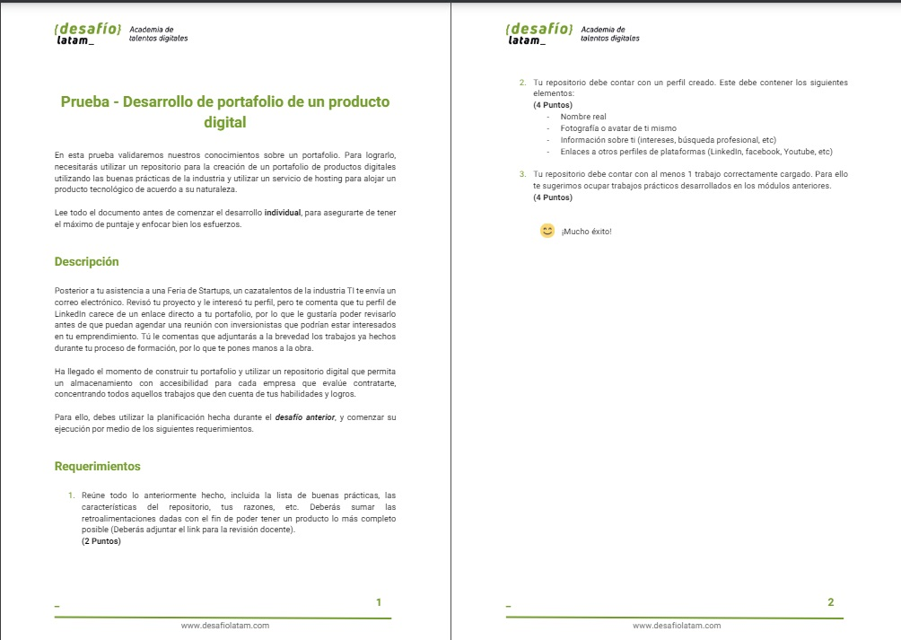
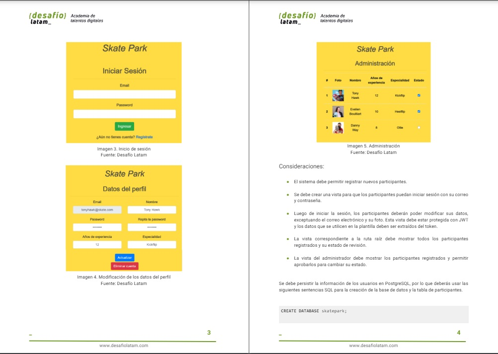
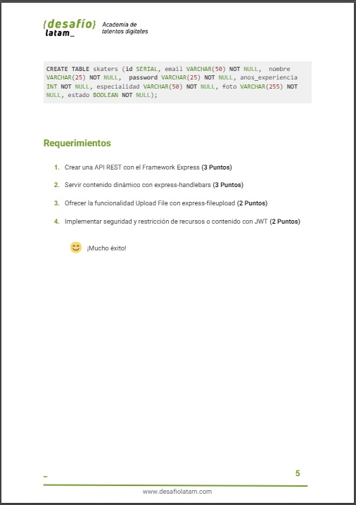

# //--------MODULO 9-Portafolio--------
 👨🏽‍💻Development Languages and Tools::
   
 &nbsp;
 &nbsp;
 &nbsp; &nbsp;
     &nbsp; &nbsp;
     &nbsp; &nbsp;    
     &nbsp; &nbsp;  
     &nbsp; &nbsp; 
    

 
🚀[portafolio](https://jviera100.github.io/)
🚀[descripcion](https://onedrive.live.com/edit?id=8AE2373A040B0C95!7203&resid=8AE2373A040B0C95!7203&ithint=file%2cdocx&authkey=!ABR_9Mff3W5tSfQ&wdo=2&cid=8ae2373a040b0c95)
🚀[perfil_github](https://github.com/jviera100)
 

www.desafiolatam.com
  

# Estructura de Directorios de my_project🚀

Este repositorio contiene los archivos y directorios siguientes:

...

- portafolio/
  - ├── assets/ │   
  - │   ├── css/
  - │   ├── js/
  - │   ├── img/
  - │   └── documents/
  - ├── index.html
  - ├── .gitignore
  - └── README.md

## Descripción de Directorios Principales

- **assets/**: Contiene recursos como hojas de estilo CSS, scripts JS, imágenes y documentos.

## Otros Archivos y Directorios

- **.gitignore**: Archivo para especificar qué archivos y directorios se deben ignorar en Git.
- **index.js**: Archivo principal de la aplicación.
- **README.md**: Este archivo de documentación.

 

